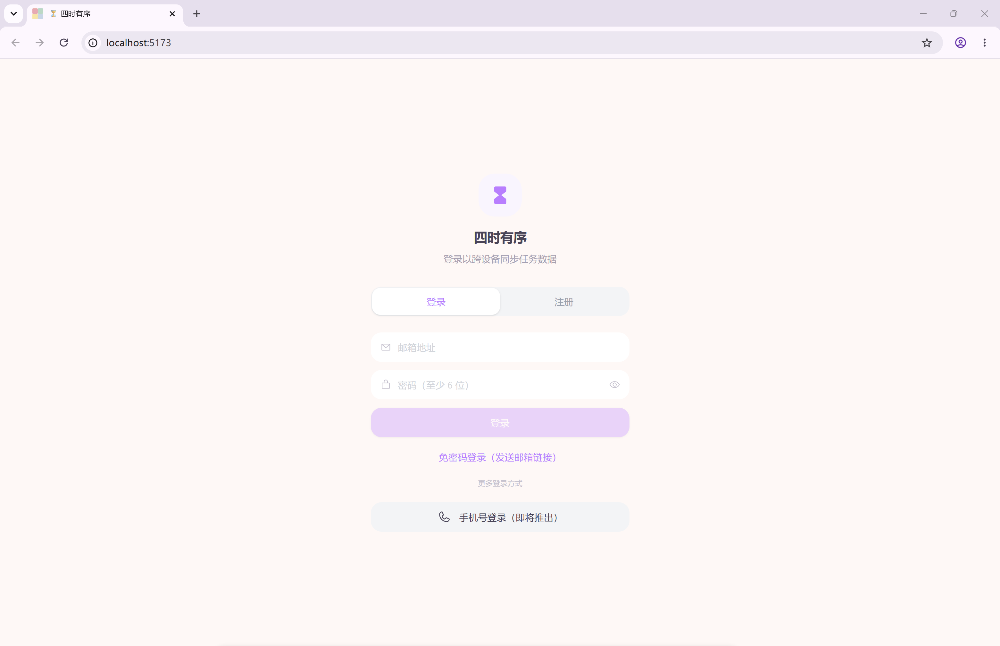
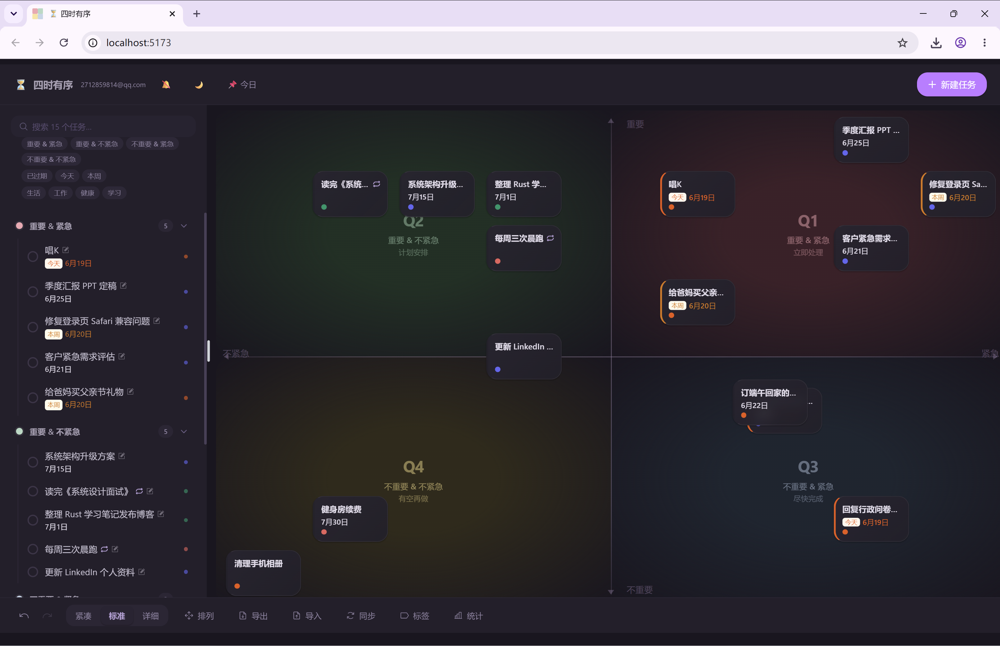
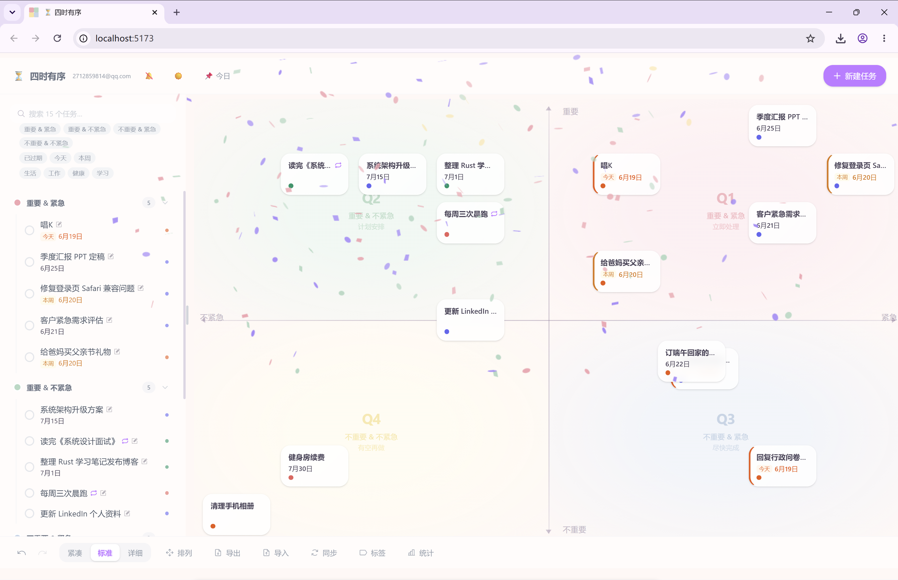
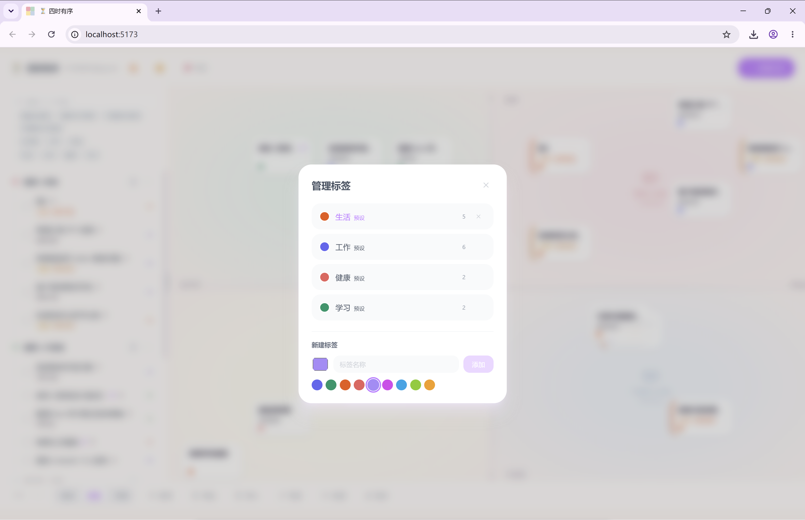
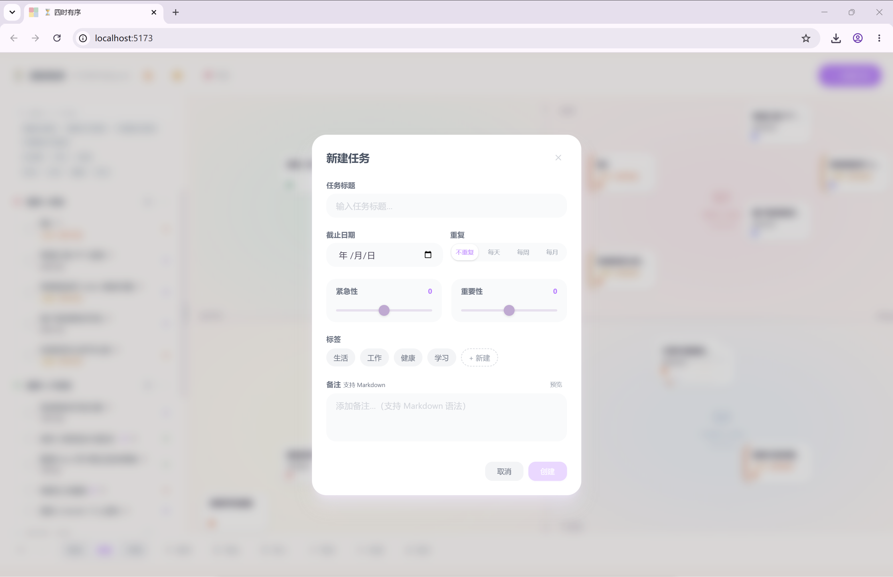

# ⏳ 四时有序

基于**艾森豪威尔矩阵**（Eisenhower Matrix）的个人任务管理工具，帮助你按「重要性」和「紧急性」两个维度组织和排列任务。一套代码，Web / Android / iOS 三端运行。

<p align="center">
  
</p>






## ✨ 功能特性

### 核心体验
- 🎯 **四象限画布** — 拖拽任务到 Q1-Q4，实时坐标 + 象限自动判定
- 🖱️ **拖拽调整** — dnd-kit 鼠标+触屏，自由调整任务位置
- ✏️ **任务管理** — 新建（按钮/双击画布/长按/N 键）、编辑、完成、删除、恢复
- 📋 **侧边栏列表** — 象限分组、可折叠、搜索、多维筛选

### 组织与效率
- ↩️ **撤销/重做** — 全部操作自动记录 50 条历史，Ctrl+Z/Y
- ☑️ **批量操作** — Ctrl+Click 多选，批量完成/删除（可撤销）
- ⌨️ **键盘快捷键** — N/Esc///D/Ctrl+Z/Ctrl+Y 全覆盖
- 📌 **今日焦点** — 一键高亮近期任务，非紧急半透明
- 🔄 **一键排列** — 优先级网格排列，黄金角碰撞避让
- 🔁 **重复任务** — 每天/每周/每月重复，完成时自动生成下一期，恢复/撤销精确清理
- 🎉 **完成庆祝** — canvas-confetti 粒子动画，单任务完成时彩色纸屑爆发，批量操作不触发
- ⏰ **到期通知** — Web Notification API + Capacitor 原生通知（Android/iOS）

### 数据管理
- 💾 **IndexedDB 持久化** — Dexie.js，离线存储，无需网络
- 📤📥 **JSON 导入/导出** — 一键备份恢复，3 种冲突策略
- 📊 **统计仪表盘** — 活跃/完成率概览、象限柱状图、标签分布、7 天趋势

### 视觉与主题
- 🌓 **主题切换** — ☀️ 浅色 / 🌙 深色二态直切
- 🎨 **深色模式全覆盖** — 全局 60+ 类名映射 + CSS 变量，所有组件完美适配暗色
- 🔍 **三种视图密度** — 紧凑（44px/仅标题）、标准（68px/标题+日期+标签）、详细（90px/级别+标题+日期+标签名+备注）
- 🎨 **截止日期状态** — 过期（红左边框）、今天（橙标签）、本周（黄标签），有无日期卡片等高
- 📝 **富文本备注** — Markdown 渲染，编辑/预览切换，卡片和列表渲染
- 🏷️ **标签管理** — 预设+自定义，独立管理面板（编辑/删除/使用统计/色板）
- 🎯 **Phosphor 图标** — 全项目统一图标库，无手写 SVG

### 跨平台
- 📱 **响应式布局** — 桌面可拖拽侧边栏 + 移动端底部抽屉，安全区域适配
- 📲 **PWA 离线** — Service Worker 缓存，可安装到主屏幕
- ☁️ **云端同步** — Supabase 认证 + 实时跨设备同步，IndexedDB 离线缓存
- 📦 **Capacitor 打包** — 一套代码 → Web / Android APK / iOS IPA

---

## 📱 跨平台

| 平台 | 技术 | 产物 | 打包命令 |
|------|------|------|----------|
| **Web** | Vite + PWA | 静态站点 | `npm run build:web` |
| **Android** | Capacitor 8 + Android Studio | `.apk` / `.aab` | `npm run build:android` |
| **iOS** | Capacitor 8 + Xcode | `.ipa`（需 Mac） | `npm run build:ios` |

```bash
.\scripts\build-all.ps1                  # 一键全平台
.\scripts\build-all.ps1 -Platform android -OpenIDE  # Android + IDE
```

---

## 🛠️ 技术栈

| 类别 | 技术 | 版本 |
|------|------|------|
| 框架 | React + TypeScript | 19.x / ~6.0 |
| 构建 | Vite (Rolldown) | ^8.0.12 |
| 样式 | Tailwind CSS | ^4.3.1 |
| 状态管理 | Zustand | ^5.0.14 |
| 拖拽 | @dnd-kit/core | ^6.3.1 |
| 数据库 | Dexie.js (IndexedDB) | ^4.4.4 |
| PWA | vite-plugin-pwa | ^1.3.0 |
| 跨平台 | Capacitor 8 | ^8.4.0 |
| 原生通知 | @capacitor/local-notifications | ^8.2.0 |
| 图标库 | @phosphor-icons/react | latest |
| Markdown | marked | latest |
| 庆祝动画 | canvas-confetti | latest |
| 认证+云同步 | Supabase | @supabase/supabase-js |

---

## 🚀 快速开始

```bash
npm install       # 安装依赖
npm run dev       # 开发服务器 http://localhost:5173
npm run build     # Web 生产构建 → dist/
npm run lint      # 代码检查
```

---

## ⌨️ 键盘快捷键

| 快捷键 | 功能 |
|--------|------|
| `N` | 新建任务 |
| `Esc` | 关闭弹窗 / 取消选择 / 关闭侧边栏 |
| `/` | 聚焦搜索框 |
| `D` | 循环切换视图密度 |
| `Ctrl+Z` | 撤销 |
| `Ctrl+Y` / `Ctrl+Shift+Z` | 重做 |
| `Ctrl+Click` / `右键` | 切换任务选中 |

---

## 📖 使用指南

### 象限划分
| 象限 | 位置 | 含义 | 颜色 |
|------|------|------|------|
| Q1 | 右上 | 重要 + 紧急 → 立即处理 | 粉 |
| Q2 | 左上 | 重要 + 不紧急 → 计划安排 | 薄荷绿 |
| Q3 | 右下 | 不重要 + 紧急 → 尽快完成 | 蓝 |
| Q4 | 左下 | 不重要 + 不紧急 → 有空再做 | 黄 |

### 任务操作
- **新建**：按钮 / 双击画布 / 长按（触屏）/ 按 `N`
- **编辑**：点击卡片或列表项
- **完成**：悬停 ✓ 按钮 / 列表勾选框。重复任务自动生成下一期
- **删除/恢复**：编辑窗内删除 / 已完成面板中恢复

### 批量操作
1. **Ctrl+Click** 或 **右键** 进入多选模式
2. 底部工具栏 → 批量完成/批量删除
3. **Esc** 或点击空白退出

### 筛选任务
- **文本**：搜索标题和备注（`/` 键聚焦）
- **象限**：Q1-Q4 色块按钮
- **日期**：过期/今天/本周标签
- **标签**：色块多选
- **今日焦点**：📌 按钮，非紧急任务半透明

### 数据备份
- **导出**：底部「导出」→ JSON 文件
- **导入**：底部「导入」→ 选文件 → 选冲突策略 → 确认

---

## 📦 打包发布

### Web
```bash
npm run build:web   # dist/ → 部署到任意服务器
```

### Android（需 Android Studio）
```bash
npm run cap:add:android          # 首次（仅一次）
npm run build:android            # 构建 + 同步
npm run cap:open:android         # 打开 Android Studio → Build APK
```

### iOS（需 Mac + Xcode）
```bash
npm run cap:add:ios              # 首次（仅一次）
npm run build:ios                # 构建 + 同步
npm run cap:open:ios             # 打开 Xcode → Archive → IPA
```

---

## 📁 项目结构

```
sishi-youxu/
├── docs/
│   ├── requirements.md        # 需求文档（50+ 条功能规格）
│   ├── changelog.md           # 版本变更记录
│   └── supabase-setup.md      # Supabase 部署指南
├── supabase/
│   └── migrations/            # SQL 数据库迁移
├── scripts/
│   └── build-all.ps1          # 一键多平台构建脚本
├── public/                    # 静态资源 + PWA 图标
├── src/
│   ├── main.tsx               # 入口
│   ├── App.tsx                # 根组件（布局、快捷键、认证门控、通知）
│   ├── index.css              # 全局样式 + 主题变量 + 深色模式覆盖
│   ├── types/                 # 类型定义
│   │   ├── index.ts           # Task/Tag 类型、象限/日期/重复工具函数
│   │   ├── supabase.ts        # Supabase 数据库类型
│   │   └── canvas-confetti.d.ts
│   ├── lib/
│   │   ├── supabase.ts        # Supabase 客户端
│   │   └── sync.ts            # 云端同步（上传/下拉/实时订阅）
│   ├── store/useStore.ts      # Zustand（含认证、历史、筛选、多选、主题）
│   ├── db/index.ts            # Dexie CRUD + 云端同步
│   └── components/
│       ├── QuadrantCanvas.tsx  # 四象限画布 + DnD Context
│       ├── TaskCard.tsx        # 拖拽卡片（日期状态、选中、焦点、庆祝）
│       ├── TaskList.tsx        # 侧边栏（搜索、筛选器、已完成面板）
│       ├── TaskForm.tsx        # 创建/编辑弹窗（Markdown 预览、重复规则）
│       ├── TagManager.tsx      # 标签管理面板
│       ├── StatsPanel.tsx      # 统计仪表盘
│       └── LoginPage.tsx       # 登录页（Magic Link）
├── android/                   # Android 原生工程（Capacitor）
├── ios/                       # iOS 原生工程（Capacitor）
├── capacitor.config.ts        # Capacitor 配置
├── vite.config.ts             # Vite 多 mode 构建
└── package.json
```

---

## 📄 文档

> 📂 [**文档索引**](./docs/README.md) — 查看文档导航和阅读顺序

| 文档 | 说明 |
|------|------|
| [需求文档](./docs/requirements.md) | 50+ 条功能规格 + 数据模型 + UI 规范 |
| [目录结构](./docs/directory-structure.md) | 完整目录树 + 数据流图 + 组件依赖 |
| [变更记录](./docs/changelog.md) | v1.0 → v1.5 版本历史 |
| [Supabase 部署指南](./docs/supabase-setup.md) | 认证配置 + 云端同步部署 |

---

MIT

一键推送github、gitee：`git push -u origin main`
